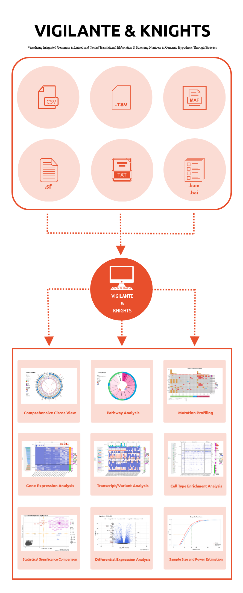

<!-- README.md is generated from README.Rmd. Please edit that file -->

```{r, include = FALSE}
knitr::opts_chunk$set(
  collapse = TRUE,
  comment = "#>",
  fig.path = "man/figures/README-",
  out.width = "100%"
)
```
# _vigilante & knights_
##### Visualizing Integrated Genomics in Linked and Nested Translational Elaboration & Knowing Numbers in Genomic Hypothesis Through Statistics

<!-- badges: start -->
<!-- badges: end -->

The goal of **_vigilante & knights_** is to facilitate data analysis and visualization in high-throughput next-generation sequencing (HT-NGS) researches by empowering researchers to perform complex, cutting-edge informatics-based analyses on their whole genome/exosome sequencing (WGS/WES) and RNA-seq data in an interactive open-source environment with statistical modules built to assess biological events. Also, **_vigilante & knights_** works in a highly self-contained pipeline style, and is designed to be user-friendly even for non-informatics researchers who don't have much experience in programming.

## Installation

Currently **_vigilante & knights_** is under reconfiguration for the official R package release, and the development version (phased release) of **_vigilante & knights_** can be installed from GitHub with:

```{r installation_dev, eval = FALSE}
devtools::install_github("yilixu/vigilante", ref = "main")
```

In addition, due to the requirement of CRAN that general packages should not exceed 5MB, the **s**upplemental **w**orkbook **o**r **r**eference **d**atasets required by **_vigilante & knights_** have been extracted and put in the standalone package **_vigilante.knights.sword_**. Please check [vigilante.knights.sword](https://github.com/yilixu/vigilante.knights.sword) for more information.

The development version of **_vigilante.knights.sword_** can be installed following the in-house prompts, or manually from GitHub with:

```{r installation_sword, eval = FALSE}
devtools::install_github("yilixu/vigilante.knights.sword", ref = "main")
```

## A Quick Glance at **_vigilante & knights_**

* The below diagram shows the input data file formats accepted by **_vigilante & knights_** and a few output figure examples created by **_vigilante & knights_** as part of the module-based analysis results:




#### References:
* Love MI, Huber W, Anders S. Moderated estimation of fold change and dispersion for RNA-seq data with DESeq2. Genome Biol. 2014;15(12):550.
* Krämer A, Green J, Pollard J Jr, Tugendreich S. Causal analysis approaches in Ingenuity Pathway Analysis. Bioinformatics. 2014 Feb 15;30(4):523-30.
* Aran D, Hu Z, Butte AJ. xCell: digitally portraying the tissue cellular heterogeneity landscape. Genome Biol. 2017 Nov 15;18(1):220. 
* Díaz-Gay, M., Vila-Casadesús, M., Franch-Expósito, S. et al. Mutational Signatures in Cancer (MuSiCa): a web application to implement mutational signatures analysis in cancer samples. BMC Bioinformatics 19, 224 (2018).
