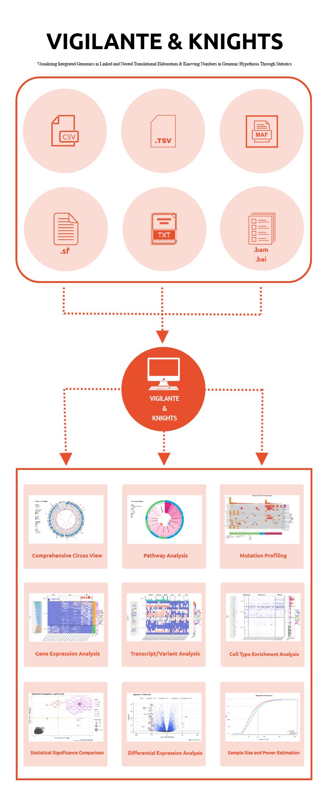

<!-- README.md is generated from README.Rmd. Please edit that file -->
*vigilante & knights*
=====================

##### Visualizing Integrated Genomics in Linked and Nested Translational Elaboration & Knowing Numbers in Genomic Hypothesis Through Statistics

<!-- badges: start -->
<!-- badges: end -->
The goal of ***vigilante & knights*** is to facilitate data analysis and visualization in high-throughput next-generation sequencing (HT-NGS) researches by empowering researchers to perform complex, cutting-edge informatics-based analyses on their whole genome/exosome sequencing (WGS/WES) and RNA-seq data in an interactive open-source environment with statistical modules built to assess biological events. Also, ***vigilante & knights*** works in a highly self-contained pipeline style, and is designed to be user-friendly even for non-informatics researchers who don't have much experience in programming.

Installation
------------

Currently ***vigilante & knights*** is under reconfiguration for the official R package release, and the development version (phased release) of ***vigilante & knights*** can be installed from GitHub with:

``` r
devtools::install_github("yilixu/vigilante", ref = "main")
```

A Quick Glance at ***vigilante & knights***
-------------------------------------------

-   The below diagram shows the input data file formats accepted by ***vigilante & knights*** and a few output figure examples created by ***vigilante & knights*** as part of the module-based analysis results:



#### References:

-   Love MI, Huber W, Anders S. Moderated estimation of fold change and dispersion for RNA-seq data with DESeq2. Genome Biol. 2014;15(12):550.
-   Krämer A, Green J, Pollard J Jr, Tugendreich S. Causal analysis approaches in Ingenuity Pathway Analysis. Bioinformatics. 2014 Feb 15;30(4):523-30.
-   Aran D, Hu Z, Butte AJ. xCell: digitally portraying the tissue cellular heterogeneity landscape. Genome Biol. 2017 Nov 15;18(1):220.
-   Díaz-Gay, M., Vila-Casadesús, M., Franch-Expósito, S. et al. Mutational Signatures in Cancer (MuSiCa): a web application to implement mutational signatures analysis in cancer samples. BMC Bioinformatics 19, 224 (2018).
